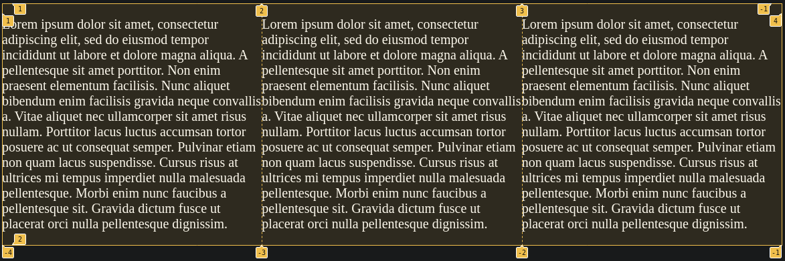
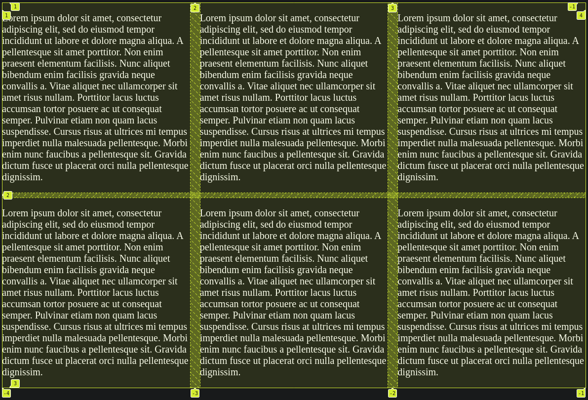
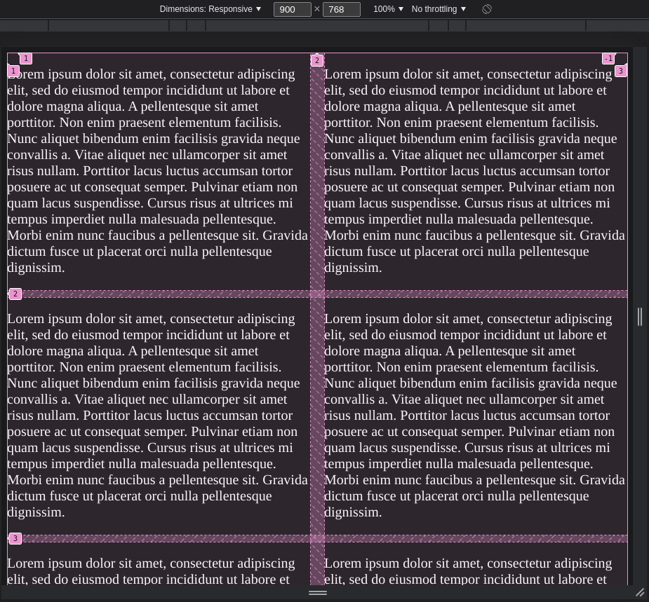
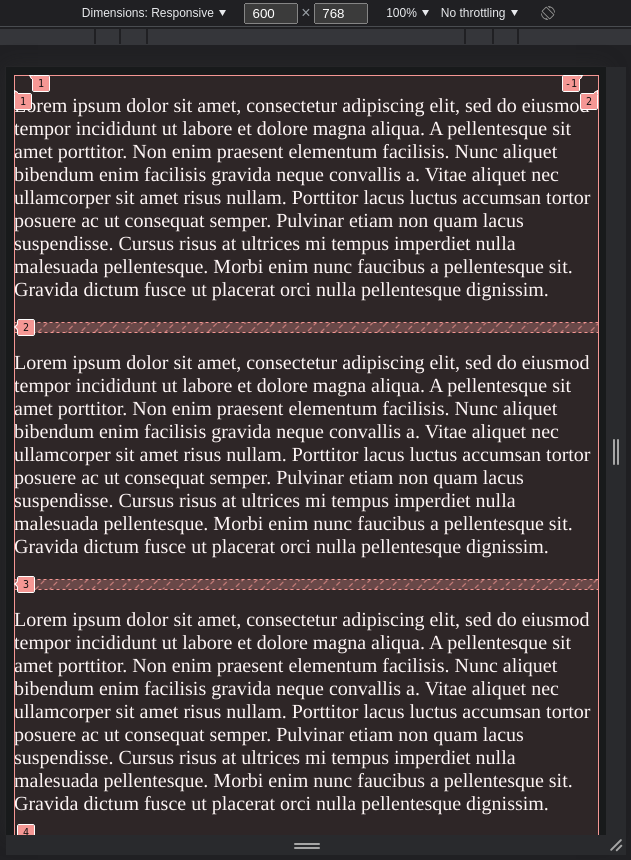
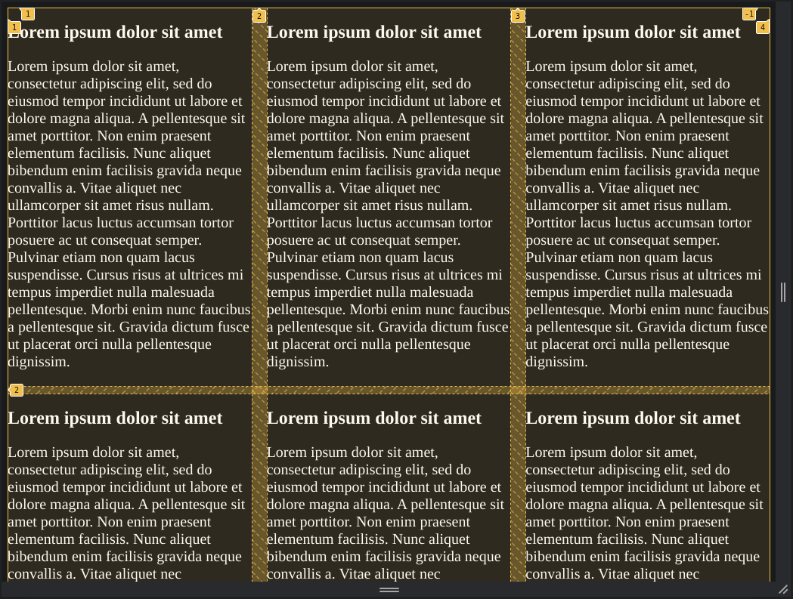
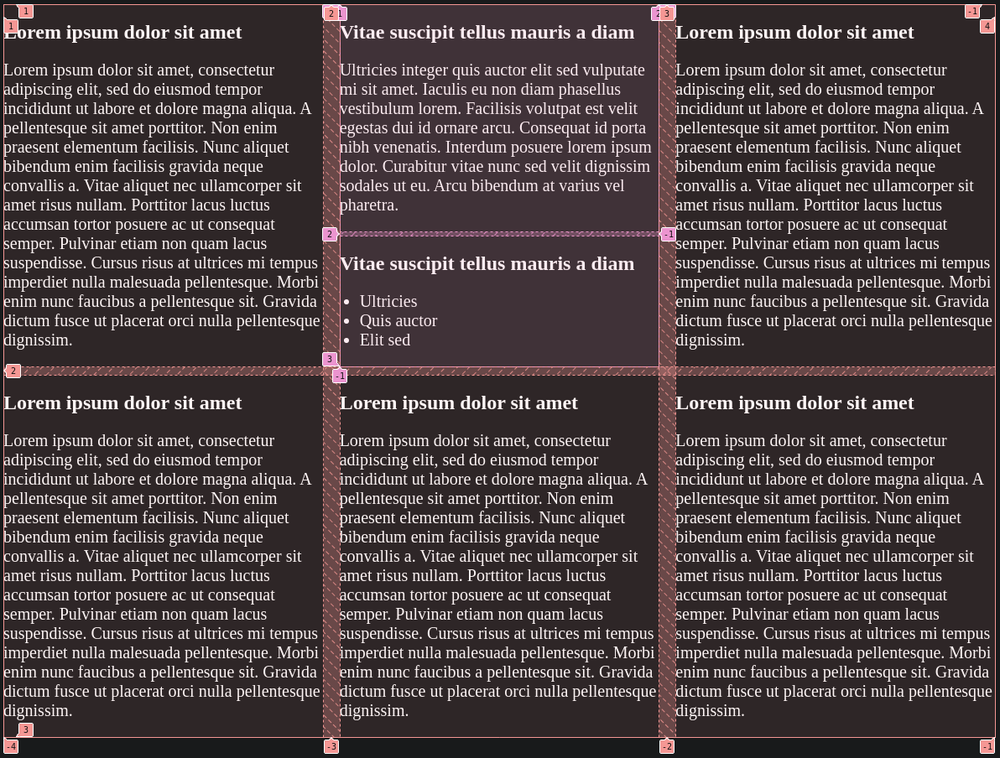
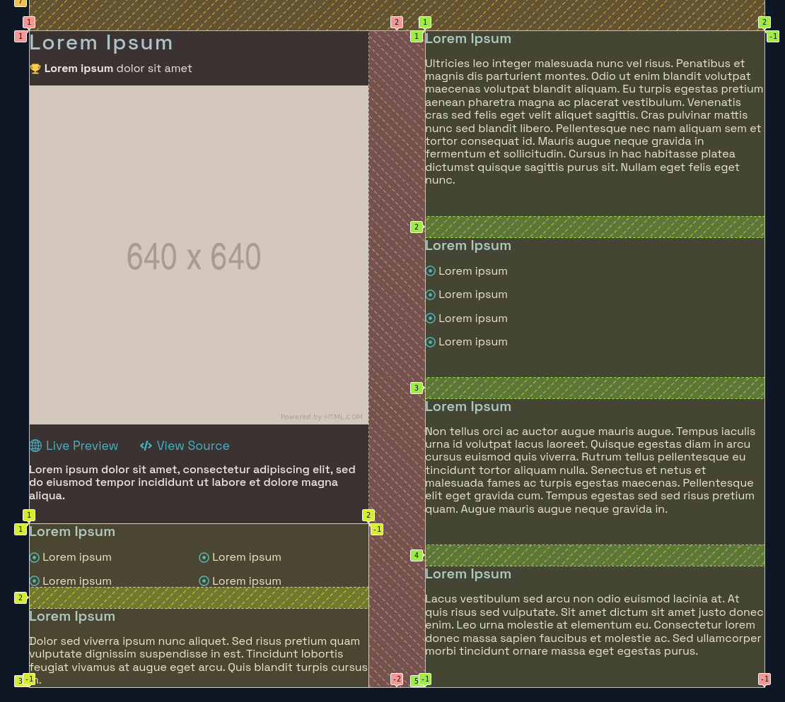
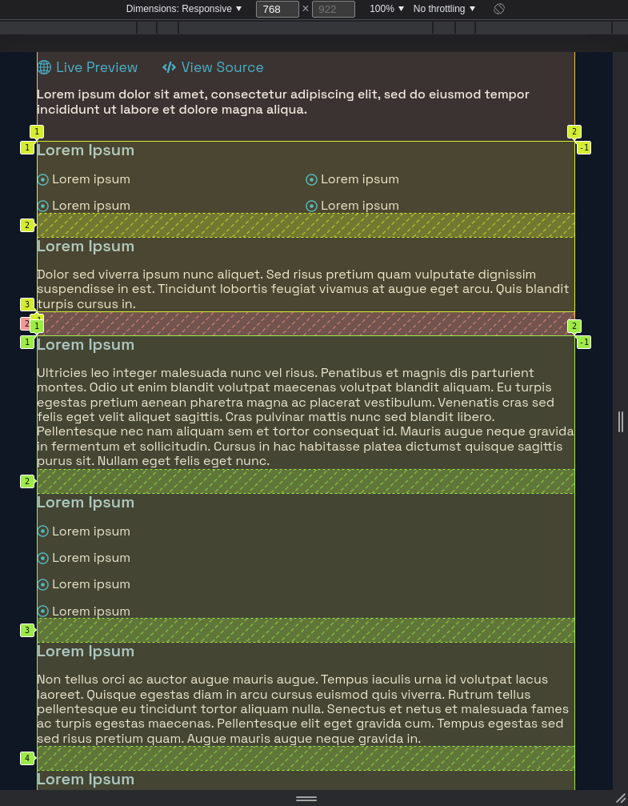

There are many ways to display content on a screen, and depending on which device you use, it can affect how good it looks. On devices in landscape mode, the width offers extra real estate for your content, but not without cost. Extra width does not mean extra line length, as it would be rather difficult to read the next line by darting your eyes from one end of the screen to the other. [^1]


Instead, we can make use of the extra space while keeping it at a readable width by sectioning content into columns using CSS Grid.

## Split Content into Columns

Let's solve the problem that was shown in the example above. We'll display the texts in 3 columns of equal width on a single row.

```html
<div class="grid">
  <p>Lorem ipsum dolor sit amet, consectetur adipiscing elit, sed do eiusmod tempor incididunt ut labore et dolore magna aliqua. A pellentesque sit amet porttitor. Non enim praesent elementum facilisis. Nunc aliquet bibendum enim facilisis gravida neque convallis a. Vitae aliquet nec ullamcorper sit amet risus nullam. Porttitor lacus luctus accumsan tortor posuere ac ut consequat semper. Pulvinar etiam non quam lacus suspendisse. Cursus risus at ultrices mi tempus imperdiet nulla malesuada pellentesque. Morbi enim nunc faucibus a pellentesque sit. Gravida dictum fusce ut placerat orci nulla pellentesque dignissim.</p>
  <p>Lorem ipsum dolor sit amet, consectetur adipiscing elit, sed do eiusmod tempor incididunt ut labore et dolore magna aliqua. A pellentesque sit amet porttitor. Non enim praesent elementum facilisis. Nunc aliquet bibendum enim facilisis gravida neque convallis a. Vitae aliquet nec ullamcorper sit amet risus nullam. Porttitor lacus luctus accumsan tortor posuere ac ut consequat semper. Pulvinar etiam non quam lacus suspendisse. Cursus risus at ultrices mi tempus imperdiet nulla malesuada pellentesque. Morbi enim nunc faucibus a pellentesque sit. Gravida dictum fusce ut placerat orci nulla pellentesque dignissim.</p>
  <p>Lorem ipsum dolor sit amet, consectetur adipiscing elit, sed do eiusmod tempor incididunt ut labore et dolore magna aliqua. A pellentesque sit amet porttitor. Non enim praesent elementum facilisis. Nunc aliquet bibendum enim facilisis gravida neque convallis a. Vitae aliquet nec ullamcorper sit amet risus nullam. Porttitor lacus luctus accumsan tortor posuere ac ut consequat semper. Pulvinar etiam non quam lacus suspendisse. Cursus risus at ultrices mi tempus imperdiet nulla malesuada pellentesque. Morbi enim nunc faucibus a pellentesque sit. Gravida dictum fusce ut placerat orci nulla pellentesque dignissim.</p>
</div>
```

```css
.grid {
  display: grid;
  grid-template-columns: repeat(3, 1fr);
}
```

The result is a less dreadful version of what we had above, and it's definitely more readable now that each section has a shorter width.




## Equal Spacing Between Columns and Rows

However, the columns are packed too close together, so it's hard to tell where one section starts and another section ends.

Let's put a `20px` gap between columns and `10px` gap between rows.

```css
.grid {
  ...
  column-gap: 20px;
  row-gap: 10px;
}
```



It's starting to look better. We can clearly see where the gaps/gutters are between each row and column.

## Using Media Queries to Adjust Column Amount

While we said earlier that long strings of text are not ideal on wider screens, the opposite is also true. A smaller width could also make it hard to read, especially if there are many columns.

We can adjust the amount of columns to display for different device widths by using media queries. We may want 3 columns on desktop, but on tablets we can display 2 columns, and on mobile, 1 column.

For simplicity, let's consider a width of `900px` and below a tablet, and a width of `600px` and below a mobile phone. 

### Tablet

```css
.grid { ... }

/* Tablets */
@media screen and (max-width: 900px) {
  .grid {
    grid-template-columns: 1fr 1fr;
  }
}
```



### Mobile Phone

```css
/* Tablets */
...

/* Mobile */
@media screen and (max-width: 600px) {
  .grid {
    grid-template-columns: 1fr;
  }
}
```



## Adding More Elements to Grid Sections

When using a grid layout, the immediate children of the grid container (in this case the `div` with class `grid`) are the ones that get rearranged into rows and columns.

Let's encapsulate the existing paragraphs into a `div` and give each one a title as well.

```html
<div class="grid">
  <div>
    <h2>Lorem ipsum dolor sit amet</h2>
    <p>Lorem ipsum dolor sit amet, consectetur adipiscing elit, sed do eiusmod tempor incididunt ut labore et dolore magna aliqua. A pellentesque sit amet porttitor. Non enim praesent elementum facilisis. Nunc aliquet bibendum enim facilisis gravida neque convallis a. Vitae aliquet nec ullamcorper sit amet risus nullam. Porttitor lacus luctus accumsan tortor posuere ac ut consequat semper. Pulvinar etiam non quam lacus suspendisse. Cursus risus at ultrices mi tempus imperdiet nulla malesuada pellentesque. Morbi enim nunc faucibus a pellentesque sit. Gravida dictum fusce ut placerat orci nulla pellentesque dignissim.</p>
  </div>
  ...
</div>
```

The grid's immediate children retain their original structure.



## Nesting Grids within Grids

Why stop at one grid, when you can have many? You can have multiple grids nested inside each other, each with its own styling. It may seem complicated, but you're basically applying the same concepts at a larger scale.

Let's rename `grid` to `grid-1` and create `grid-2`. The second grid will display its contents in a single column and have a `row-gap` of `5px`.

```html
<div class="grid-1">
  <div>
    <h2>Lorem ipsum dolor sit amet</h2>
    <p>Lorem ipsum dolor sit amet, consectetur adipiscing elit, sed do eiusmod tempor incididunt ut labore et dolore magna aliqua. A pellentesque sit amet porttitor. Non enim praesent elementum facilisis. Nunc aliquet bibendum enim facilisis gravida neque convallis a. Vitae aliquet nec ullamcorper sit amet risus nullam. Porttitor lacus luctus accumsan tortor posuere ac ut consequat semper. Pulvinar etiam non quam lacus suspendisse. Cursus risus at ultrices mi tempus imperdiet nulla malesuada pellentesque. Morbi enim nunc faucibus a pellentesque sit. Gravida dictum fusce ut placerat orci nulla pellentesque dignissim.</p>
  </div>
  <div class="grid-2">
    <div>
      <h2>Vitae suscipit tellus mauris a diam</h2>
      <p>Ultricies integer quis auctor elit sed vulputate mi sit amet. Iaculis eu non diam phasellus vestibulum lorem. Facilisis volutpat est velit egestas dui id ornare arcu. Consequat id porta nibh venenatis. Interdum posuere lorem ipsum dolor. Curabitur vitae nunc sed velit dignissim sodales ut eu. Arcu bibendum at varius vel pharetra.</p>
    </div>
    <div>
      <h2>Vitae suscipit tellus mauris a diam</h2>
      <ul>
        <li>Ultricies</li>
        <li>Quis auctor</li>
        <li>Elit sed</li>
      </ul>
    </div>
  </div>
  ...
</div>
```

```css
.grid-1 {
  display: grid;
  grid-template-columns: repeat(3, 1fr);
  column-gap: 20px;
  row-gap: 10px;
}

.grid-2 {
  display: grid;
  row-gap: 5px;
}
```



## Conclusion

Using only CSS grid, you can create beautiful, responsive layouts for desktops, laptops, tablets, and mobile devices. To show you all the methods listed above in action, here is a layout that I use for my personal website.

Each colored section is its own grid, and the combined grids are part of a larger grid!





[^1]: [Perfect Content Width](https://socialtriggers.com/perfect-content-width/)